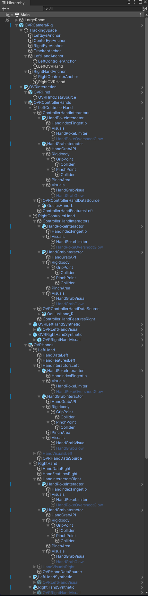
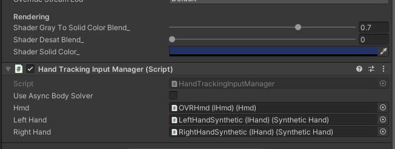

# interaction-sdk-avatars2-integration

Code modified and extended from [oculus-samples/Unity-Decomissioned](https://github.com/oculus-samples/Unity-Decommissioned)

## Purpose

Provides a system to use the OVRSyntheticHand as a data source for Meta Avatars in order to allow avatar fingers to follow poses and be affected by Poke Interactables.

## Project setup

1. Have an OVRCameraRig set up in a way that already works in your project with the ghost hands. It should have an OVRInteraction prefab on it, preferably with both hand tracking hands and controller hands. Mine looks like this:

If you're not sure how to set this up, check on [Valem's Interaction SDK video series](https://www.youtube.com/playlist?list=PLpEoiloH-4eMRR8wAfy22ecQeCT2tIuMD). Videos 1, 3, and 7 are most important, but I highly suggest watching them all if you are unsure, especially because some necessary changes due updates to the Interaction SDK are in the comments of each tutorial.
2. Import the Avatars package after downloading it from Meta' website or MQDH.
3. Add an AvatarSdkManagerHorizon and remove the SampleInputManager from it.
4. Add a new empty gameobject (I called mine Avatar) and add a SampleAvatarEntity to it.
5. To the same gameobject, add the Hand Tracking Input Manager from this repo. Make sure that you have the entire Avatars folder from this repo in your project, however.
6. Drop in your HMD, and select the LeftHandSynthetic and RightHandSynthetic for the Left Hand and Right Hand. It should now look like this:

7. Drag the Hand Tracking Input Manager into the Body Tracking behavior slot in the Sample Avatar Entity Tracking Input section.
8. You could set up Face, Eye Pose, and Lip Sync behaviors yourself later on. However, you should now be able to press play and test your avatar interacting with your game.

**If it all works,** go ahead and disable the visuals for the Synthetic ghost hands so they're not z-fighting with the avatar.

**If a generic avatar appears,** make sure you have complete the Data Use Checkup for Avatars (need User ID, User Profile, and Avatars in a request), then copy your App ID into the *Oculus/Platform/Edit Settings* window. For your avatar to show up in the Unity Editor in addition to on Quest, you'll need to create an app for both Rift and Quest.

## Auto-switch between controllers and hands

1. Ensure your OVRCameraRig setup matches (at least loosely) mine shown above.
2. Create a new empty GameObject, and to it add the `AvatarDataSourceSwitcher.cs` script.
3. Populate the `Avatar`, `Left Hand`, `Right Hand`, `Left Controller Hand`, and `Right Controller Hand` fields.
4. Create two new empty GameObjects as children of the last one. At this step, ensure that *every* transform is reset to 0 for all the objects you just created.
5. Add a Hand Tracking Input Manager to each of these empties, and populate the `Hmd`, `Left Hand`, and `Right Hand` variables as you did above with a reference to the `OVRHmd` and Synthetic hands. However, on the second empty, use the Synthetic hands that use the controllers as a data source.
6. Return to your parent GameObject and fill the `Hand Tracking Input Manager` and `Controller Tracking Input Manager` with the two HandTrackingInputManagers that you created in the last step.
7. Assuming that your OVRCameraRig has `Controllers And Hands` enabled for *Hand Tracking Support*, you should now be able to play your game, and see your avatar quickly switch between hand and controller tracking.
